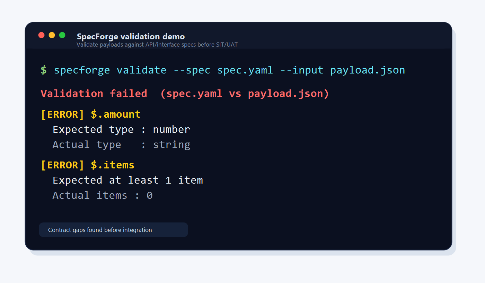

# SpecForge


Find API payload gaps before SIT/UAT, not during SIT/UAT.



SpecForge validates JSON payloads against API/interface specs and reports contract gaps clearly.

SpecForge is a CLI toolkit for validating JSON payloads against API/interface specs, generating mock payloads, and detecting breaking changes between spec versions.

---

## Why SpecForge?

In multi-team API integration, payload issues are often found too late during SIT/UAT.

Common problems include:

- Required fields are missing
- Field types do not match the agreed spec
- Nested objects or arrays are structured differently
- Teams interpret spreadsheet-based specs differently
- Breaking changes between spec versions are not clearly visible

SpecForge helps shift these checks earlier by turning API/interface specs into repeatable validation, mock generation, and spec diff workflows.

---

## Install

```bash
pip install specforge
```

---

## Quick start

### 1. Write a spec

```yaml
# spec.yaml
type: object
fields:
  transactionReference:
    type: string
    required: true
    maxLength: 50
  amount:
    type: number
    required: true
    minimum: 0.01
  status:
    type: string
    required: true
    enum: [PENDING, ACTIVE, CLOSED]
  items:
    type: array
    required: true
    minItems: 1
    items:
      type: object
      fields:
        productName:
          type: string
          required: true
        quantity:
          type: integer
          required: true
          minimum: 1
```

### 2. Validate a payload

```bash
specforge validate --spec spec.yaml --input payload.json
```

```text
Validation passed  (spec.yaml vs payload.json)
  Fields checked : 5
  Passed         : 5
  Failed         : 0
```

### 3. Generate mock payloads

```bash
specforge mock --spec spec.yaml --mode minimal
specforge mock --spec spec.yaml --mode full --count 5
specforge mock --spec spec.yaml --seed 42
```

Modes: `minimal` (required fields only), `full` (all fields), `edge` (boundary values), `example` (realistic data)

### 4. Diff two spec versions

```bash
specforge diff --old v1.yaml --new v2.yaml
specforge diff --old v1.yaml --new v2.yaml --format json
specforge diff --old v1.yaml --new v2.yaml --fail-on-breaking
```

### 5. Import from CSV or Excel

If your team keeps specs in a spreadsheet, convert them directly:

```bash
specforge import-csv   --input spec.csv   --output spec.yaml
specforge import-excel --input spec.xlsx  --output spec.yaml
```

Omit `--output` to print to stdout.

---

## Example validation failure

If `amount` is sent as a string instead of a number:

```json
{
  "transactionReference": "TXN-001",
  "amount": "100.00",
  "status": "ACTIVE",
  "items": []
}
```

Run:

```bash
specforge validate --spec spec.yaml --input payload.json
```

SpecForge reports:

```text
Validation failed  (spec.yaml vs payload.json)

[ERROR] $.amount
Expected type : number
Actual type   : string

[ERROR] $.items
Expected at least 1 item
Actual items : 0
```

---

## Commands

| Command | What it does |
|---|---|
| `validate` | Check a JSON payload against a spec |
| `mock` | Generate mock payloads from a spec |
| `diff` | Compare two spec versions and explain changes |
| `import-csv` | Convert a CSV spec sheet into a YAML spec |
| `import-excel` | Convert an Excel spec sheet into a YAML spec |

---

## Best for

- Backend developers validating API request/response payloads
- QA engineers preparing integration test data
- System analysts converting mapping specs into validation rules
- Integration teams checking payload gaps before SIT/UAT
- Teams that manage API specs in CSV or Excel

---

## How is this different from a JSON diff tool?

JSON diff tools show where two payloads are different.

SpecForge checks whether a payload is valid according to the agreed API/interface spec.

It validates:

- Required and optional fields
- Data types
- Enum values
- Length and numeric rules
- Nested objects and arrays
- Breaking changes between spec versions

---

## Spec format

Specs are YAML files with this structure:

```yaml
type: object
fields:
  <field_name>:
    type: string | integer | number | boolean | object | array | null
    required: true | false          # default: false
    nullable: true | false          # default: true
    description: "..."
    # String
    minLength: 1
    maxLength: 255
    pattern: "^[A-Z]+"
    format: email | date | date-time
    # Number
    minimum: 0
    maximum: 100
    # Enum
    enum: [A, B, C]
    # Object
    fields:
      <nested_field>: ...
    # Array
    items:
      type: object
      fields: ...
    minItems: 1
    maxItems: 10
    uniqueItems: true
```

---

## CSV / Excel column reference

Use one header row with these columns (`field_name` and `type` are required):

| Column | Required | Description |
|---|---|---|
| `field_name` | Yes | Field path - use dot notation for nesting: `address.street` |
| `type` | Yes | `string` `integer` `number` `boolean` `object` `array` `null` |
| `required` | | `true` / `false` (default: `false`) |
| `nullable` | | `true` / `false` (default: `true`) |
| `description` | | Free text |
| `item_type` | | Required when `type=array`: type of each item |
| `format` | | `email` `date` `date-time` |
| `enum` | | Pipe-delimited values: `A\|B\|C` (no escape - values cannot contain `\|`) |
| `default` | | Default value (stored as string) |
| `min_length` | | Minimum string length |
| `max_length` | | Maximum string length |
| `pattern` | | Regex pattern |
| `minimum` | | Minimum numeric value |
| `maximum` | | Maximum numeric value |
| `min_items` | | Minimum array length |
| `max_items` | | Maximum array length |
| `unique_items` | | `true` / `false` |

**Nested objects** - use dot notation in `field_name`:

```text
address.street -> creates address (object) -> street (string)
```

**Array items** - use the reserved `item` segment:

```text
orders.item.productId -> fields inside each array element
```

---

## Requirements

- Python 3.11+
- `openpyxl` is included for Excel support

---

## Roadmap / Planned features

- [ ] Markdown validation report
- [ ] HTML validation report
- [ ] OpenAPI import
- [ ] Postman collection import
- [ ] Conditional required fields
- [ ] Better nested array validation
- [ ] CI/CD examples

Example future rule:

```text
If customerType = corporate, companyRegistrationId is required.
```

---

## Install for development

```bash
git clone <repo>
cd specforge
python -m venv .venv
source .venv/bin/activate   # Windows: .venv\Scripts\activate
pip install -e ".[dev]"
pytest
```

---

## License

MIT License

---

## Feedback / Contributing

Issues, feature requests, and examples from real integration workflows are welcome.
